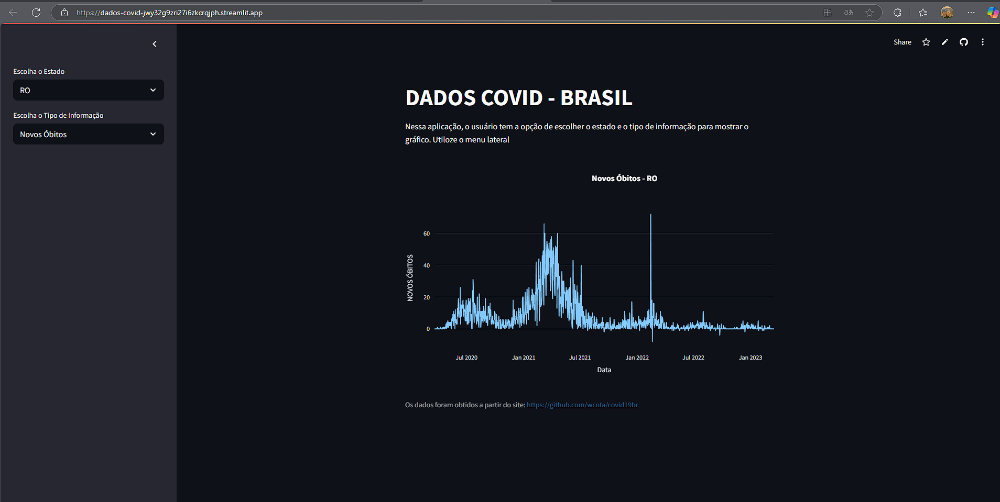

# Grafico de Dados de Covid até o ano de 2023 

Grafico de dados de Covid feito em projeto 
[DIO Compartilhando Gráficos Interativos da Covid-19 com Python](https://web.dio.me/lab/compartilhando-graficos-interativos-da-covid-19-com-python/learning/128645ba-8700-4d09-9b56-1f1bd7dabd0a?back=/play)

Feito com python e bibliotecas **pandas**, **plotly.express**, **os**, **streamlit**

[Link do Gráfico](https://dados-covid-jwy32g9zri27i6zkcrqjph.streamlit.app/)